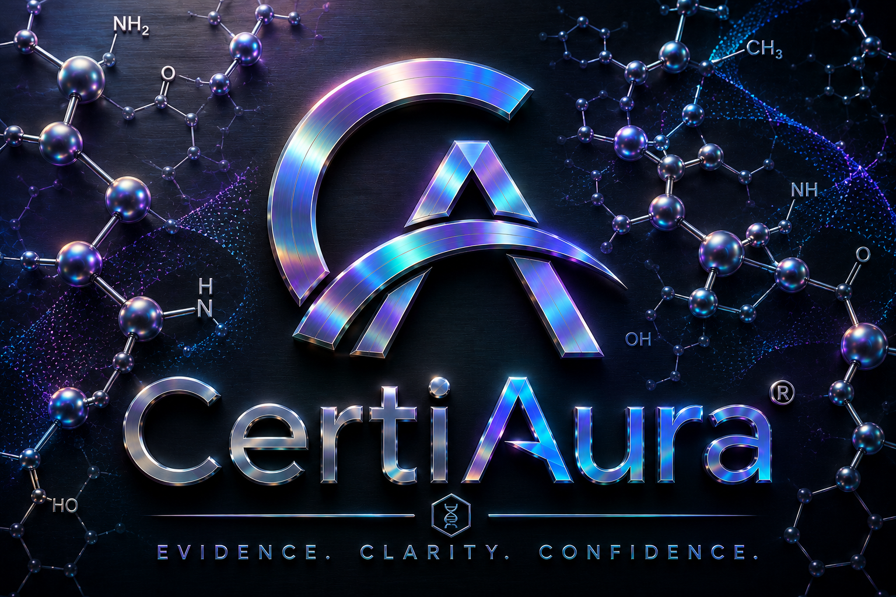

---

# CERT-BKS-000055 — Insulin-Like Growth Factor Binding Proteins

**Status:** Foundation asset  
**Last Review:** 2026-07-16

## Summary

Binding proteins that regulate IGF distribution, half-life and receptor access.
